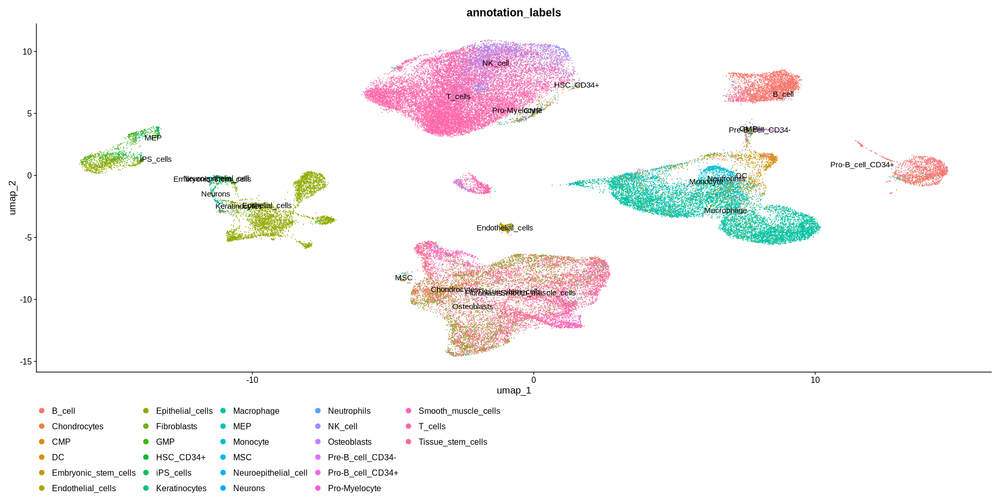

## Single-cell Analysis Assesment. Alperen Uysal, MD, PhDc. Ege University, Izmir, Turkey.

# 3. Cell Type Annotation:

``` r
library(SeuratDisk)
```

    ## Registered S3 method overwritten by 'SeuratDisk':
    ##   method            from  
    ##   as.sparse.H5Group Seurat

``` r
library(Seurat)
```

    ## Loading required package: SeuratObject

    ## Loading required package: sp

    ## 
    ## Attaching package: 'SeuratObject'

    ## The following objects are masked from 'package:base':
    ## 
    ##     intersect, t

``` r
library(SingleR)
```

    ## Loading required package: SummarizedExperiment

    ## Loading required package: MatrixGenerics

    ## Loading required package: matrixStats

    ## 
    ## Attaching package: 'MatrixGenerics'

    ## The following objects are masked from 'package:matrixStats':
    ## 
    ##     colAlls, colAnyNAs, colAnys, colAvgsPerRowSet, colCollapse,
    ##     colCounts, colCummaxs, colCummins, colCumprods, colCumsums,
    ##     colDiffs, colIQRDiffs, colIQRs, colLogSumExps, colMadDiffs,
    ##     colMads, colMaxs, colMeans2, colMedians, colMins, colOrderStats,
    ##     colProds, colQuantiles, colRanges, colRanks, colSdDiffs, colSds,
    ##     colSums2, colTabulates, colVarDiffs, colVars, colWeightedMads,
    ##     colWeightedMeans, colWeightedMedians, colWeightedSds,
    ##     colWeightedVars, rowAlls, rowAnyNAs, rowAnys, rowAvgsPerColSet,
    ##     rowCollapse, rowCounts, rowCummaxs, rowCummins, rowCumprods,
    ##     rowCumsums, rowDiffs, rowIQRDiffs, rowIQRs, rowLogSumExps,
    ##     rowMadDiffs, rowMads, rowMaxs, rowMeans2, rowMedians, rowMins,
    ##     rowOrderStats, rowProds, rowQuantiles, rowRanges, rowRanks,
    ##     rowSdDiffs, rowSds, rowSums2, rowTabulates, rowVarDiffs, rowVars,
    ##     rowWeightedMads, rowWeightedMeans, rowWeightedMedians,
    ##     rowWeightedSds, rowWeightedVars

    ## Loading required package: GenomicRanges

    ## Loading required package: stats4

    ## Loading required package: BiocGenerics

    ## 
    ## Attaching package: 'BiocGenerics'

    ## The following object is masked from 'package:SeuratObject':
    ## 
    ##     intersect

    ## The following objects are masked from 'package:stats':
    ## 
    ##     IQR, mad, sd, var, xtabs

    ## The following objects are masked from 'package:base':
    ## 
    ##     anyDuplicated, aperm, append, as.data.frame, basename, cbind,
    ##     colnames, dirname, do.call, duplicated, eval, evalq, Filter, Find,
    ##     get, grep, grepl, intersect, is.unsorted, lapply, Map, mapply,
    ##     match, mget, order, paste, pmax, pmax.int, pmin, pmin.int,
    ##     Position, rank, rbind, Reduce, rownames, sapply, setdiff, sort,
    ##     table, tapply, union, unique, unsplit, which.max, which.min

    ## Loading required package: S4Vectors

    ## 
    ## Attaching package: 'S4Vectors'

    ## The following object is masked from 'package:utils':
    ## 
    ##     findMatches

    ## The following objects are masked from 'package:base':
    ## 
    ##     expand.grid, I, unname

    ## Loading required package: IRanges

    ## 
    ## Attaching package: 'IRanges'

    ## The following object is masked from 'package:sp':
    ## 
    ##     %over%

    ## Loading required package: GenomeInfoDb

    ## Loading required package: Biobase

    ## Welcome to Bioconductor
    ## 
    ##     Vignettes contain introductory material; view with
    ##     'browseVignettes()'. To cite Bioconductor, see
    ##     'citation("Biobase")', and for packages 'citation("pkgname")'.

    ## 
    ## Attaching package: 'Biobase'

    ## The following object is masked from 'package:MatrixGenerics':
    ## 
    ##     rowMedians

    ## The following objects are masked from 'package:matrixStats':
    ## 
    ##     anyMissing, rowMedians

    ## 
    ## Attaching package: 'SummarizedExperiment'

    ## The following object is masked from 'package:Seurat':
    ## 
    ##     Assays

    ## The following object is masked from 'package:SeuratObject':
    ## 
    ##     Assays

With the code below, the seurat object, which was saved in the dimension
reduction session, was loaded to the R environment.

``` r
# load the data
seurat.obj <- LoadH5Seurat("../output/reducted.h5Seurat")
```

    ## Validating h5Seurat file

    ## Initializing RNA with data

    ## Adding counts for RNA

    ## Adding scale.data for RNA

    ## Adding feature-level metadata for RNA

    ## Adding variable feature information for RNA

    ## Adding reduction pca

    ## Adding cell embeddings for pca

    ## Adding feature loadings for pca

    ## Adding miscellaneous information for pca

    ## Adding reduction umap

    ## Adding cell embeddings for umap

    ## Adding miscellaneous information for umap

    ## Adding graph RNA_nn

    ## Adding graph RNA_snn

    ## Adding command information

    ## Adding cell-level metadata

    ## Adding miscellaneous information

    ## Adding tool-specific results

# SingleR Usage

To annotate single-cell RNA sequencing data with predicted cell types,
**SingleR** package was used. SingleR is a reference-based method that
labels single cells by comparing their expression profiles to a
reference dataset of known cell types.

The following steps were performed:

**Reference Data**: The `HumanPrimaryCellAtlasData` function from the
**celldex** package was used to load a reference dataset containing cell
type annotations from primary human cells. This dataset provides the
`label.main` column for high-level cell type labels.

``` r
ref <- celldex::HumanPrimaryCellAtlasData()
```

    ## see ?celldex and browseVignettes('celldex') for documentation

    ## loading from cache

    ## see ?celldex and browseVignettes('celldex') for documentation

    ## loading from cache

**Converting Seurat Object**: Our single-cell data, stored in a Seurat
object (`seurat.obj`), was converted into a format compatible with
SingleR using the `as.SingleCellExperiment` function.

**Annotation**: The `SingleR` function was employed to classify the
cells in our dataset. It compared the gene expression profiles of our
test dataset against the reference and assigned the most likely cell
type label from the reference.

``` r
results <- SingleR(test = as.SingleCellExperiment(seurat.obj),
                      ref = ref,
                      labels = ref$label.main)
```

This approach leverages the curated knowledge in the Human Primary Cell
Atlas to achieve high-confidence cell type annotations, enabling
downstream biological analyses.

For more details, see the [SingleR
documentation](https://bioconductor.org/packages/release/bioc/html/SingleR.html).

After annotating cells with SingleR, we integrated the results into the
Seurat object and visualized them using UMAP:

Adding Annotations: The cell type labels from SingleR (results\$labels)
were added to the Seurat object as a new metadata column,
annotation_labels.

``` r
seurat.obj$annotation_labels <- results$labels
```

The DimPlot function was used to create a UMAP plot, grouping cells by
their annotations. Labels were added directly to the plot for clarity.

``` r
DimPlot(seurat.obj,
        reduction = "umap",
        group.by = "annotation_labels",
        label = T)
```

<!-- -->

This plot shows the distribution of annotated cell types across
clusters.

The final seurat object was saved as annotated.rds to use in next steps.

``` r
saveRDS(seurat.obj, file = "../output/annotated.rds")
```
