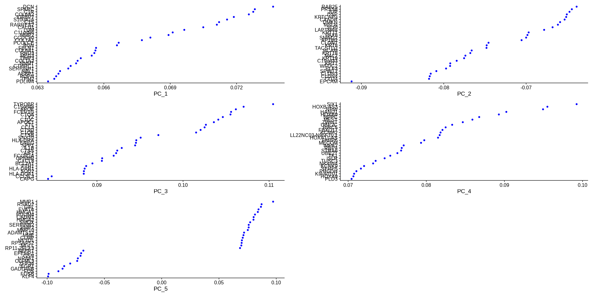
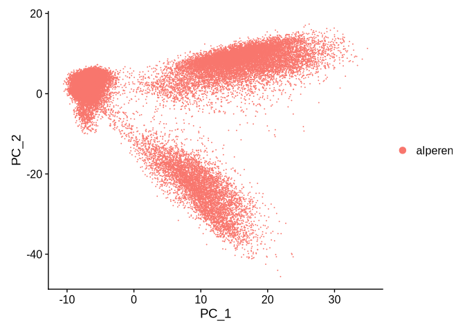
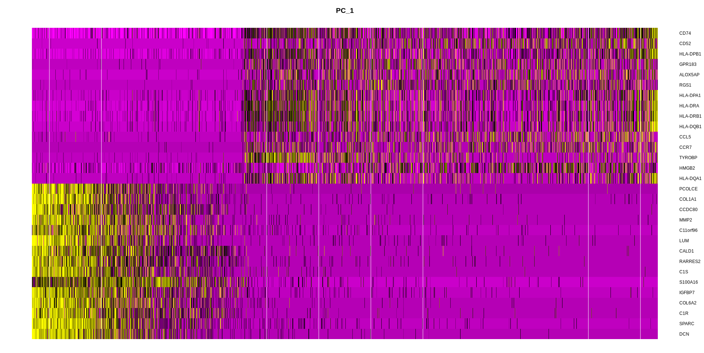
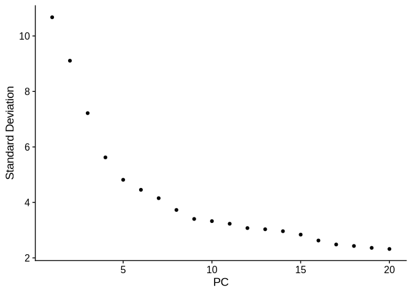
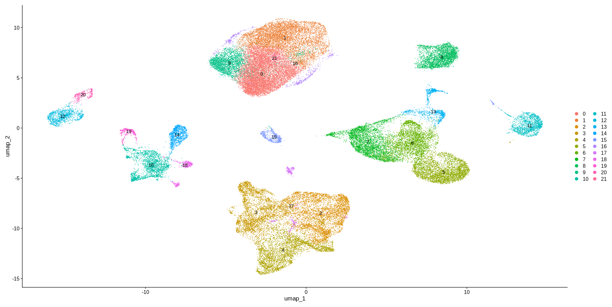

## Single-cell Analysis Assesment. Alperen Uysal, MD, PhDc. Ege University, Izmir, Turkey.

# 2. Dimensionality Reduction and Clustering:

With the Seurat object prepared, proceed to perform dimensionality
reduction using Principal Component Analysis (PCA) to capture the
primary sources of variation in the dataset. Following PCA, apply
Uniform Manifold Approximation and Projection (UMAP) to visualize the
data in a two-dimensional space, facilitating the identification of
distinct cell populations. Subsequently, conduct clustering to group
cells with similar expression profiles, which will aid in the annotation
of cell types.

# Workflow:

``` r
library(Seurat)
```

    ## Loading required package: SeuratObject

    ## Loading required package: sp

    ## 
    ## Attaching package: 'SeuratObject'

    ## The following objects are masked from 'package:base':
    ## 
    ##     intersect, t

``` r
library(SeuratDisk)
```

    ## Registered S3 method overwritten by 'SeuratDisk':
    ##   method            from  
    ##   as.sparse.H5Group Seurat

``` r
library(dplyr)
```

    ## 
    ## Attaching package: 'dplyr'

    ## The following objects are masked from 'package:stats':
    ## 
    ##     filter, lag

    ## The following objects are masked from 'package:base':
    ## 
    ##     intersect, setdiff, setequal, union

Let’s load the saved Seurat object.

``` r
seurat.obj <- LoadSeuratRds("../output/preprocessed.rds")
```

The code scales the data using ScaleData, a necessary step for PCA and
UMAP to remove the influence of varying gene expression magnitudes.
Scaling centers gene expression to have a mean of 0 and standard
deviation of 1.

``` r
# PCA analysis
# scale the data for PCA and UMAP purposes
all.genes <- rownames(seurat.obj)
seurat.obj <- ScaleData(seurat.obj, features = all.genes)
```

    ## Centering and scaling data matrix

This code runs PCA on the Seurat object using the variable features
identified earlier. PCA reduces the dimensionality of the data and
identifies principal components that capture most of the variance.

``` r
seurat.obj <- RunPCA(seurat.obj, 
                     features = VariableFeatures(
                       object = seurat.obj)
                     )
```

    ## PC_ 1 
    ## Positive:  DCN, SPARC, C1R, COL6A2, IGFBP7, S100A16, C1S, RARRES2, CALD1, LUM 
    ##     C11orf96, MMP2, CCDC80, COL1A1, PCOLCE, BGN, FBLN1, COL6A1, RND3, MEG3 
    ##     TIMP3, COL1A2, NNMT, CTHRC1, SERPINH1, NBL1, AEBP1, PDPN, TPM2, PDLIM4 
    ## Negative:  CD74, CD52, HLA-DPB1, GPR183, ALOX5AP, RGS1, HLA-DPA1, HLA-DRA, HLA-DRB1, HLA-DQB1 
    ##     CCL5, CCR7, TYROBP, HMGB2, HLA-DQA1, TRBC1, CST7, LTB, FCER1G, BATF 
    ##     HLA-DMA, CTSS, CD69, NKG7, ITGB2, PLEK, CCL4, LYZ, HLA-DRB5, KLRB1 
    ## PC_ 2 
    ## Positive:  DCN, INHBA, LUM, PDPN, MMP2, SOD2, PMP22, C11orf96, PRRX1, COL6A2 
    ##     CTSL, MT2A, SPARC, TWIST2, CXCL8, CLMP, BGN, COL6A3, CXCL3, TNFAIP6 
    ##     COL1A2, AEBP1, CTSK, SERPINF1, PCOLCE, TBX3, C1S, COL1A1, GFPT2, COL3A1 
    ## Negative:  EPCAM, CD24, CLDN4, CLDN3, SPINT2, ELF3, WFDC2, KRT7, C19orf33, KRT19 
    ##     MAL2, KRT18, BCAM, TACSTD2, KRT8, CLDN7, AP1M2, SMIM22, PAX8, KRT17 
    ##     LAPTM4B, SLPI, MSLN, DMKN, CXADR, KRTCAP3, DSP, JUP, PRSS8, RAB25 
    ## PC_ 3 
    ## Positive:  TYROBP, C15orf48, APOE, FCER1G, C1QA, LYZ, C1QC, APOC1, FTL, CCL3 
    ##     CTSD, C1QB, CTSB, SNX10, HLA-DRA, EREG, SPP1, IL1B, CTSS, AIF1 
    ##     FCGR2A, GPNMB, CXCL8, BCL2A1, FTH1, HLA-DRB1, SOD2, HLA-DQA1, CCL3L3, CAPG 
    ## Negative:  LDHB, TRBC1, LTB, HMGB2, KLRB1, CST7, BATF, TUBA4A, CD27, TIGIT 
    ##     OCIAD2, GZMA, GZMK, CTSW, LBH, NKG7, ITM2C, AC092580.4, CD52, CD69 
    ##     KLRD1, LY9, HERPUD1, RARRES3, PASK, HOPX, IGKC, CD79A, PIM2, FBL 
    ## PC_ 4 
    ## Positive:  SIX1, HOXB-AS3, NPW, HAND1, HOXB9, NPPC, MEST, ZWINT, UBE2C, BIRC5 
    ##     FBXO17, KCNH2, LL22NC03-N95F10.1, HOXA11-AS, FABP6, MECOM, IMPA2, RBP4, STRA6, UBE2T 
    ##     TK1, ISLR, TUSC3, NKAIN4, KCNK9, SFRP5, PHGDH, KIAA0101, HOXA9, PLD3 
    ## Negative:  MUC16, KLK6, S100A1, UCA1, KLK7, UPK1B, KLK11, FXYD3, TACSTD2, SCGB2A1 
    ##     SLPI, DSP, KRT23, EHF, WNT7A, MSLN, LYPD1, S100A14, C1orf186, CLDN7 
    ##     CLDN3, FOLR1, ABHD11-AS1, LCN2, KCNK15, SOX17, CLDN16, PERP, APOA1, ITGB4 
    ## PC_ 5 
    ## Positive:  MMP1, RSAD2, GAL, EVA1A, HMGA1, PDLIM4, CADM1, HMGA2, SMOX, SERPINB2 
    ##     BMP2, MMP10, ADAMTS12, MME, CLMP, NETO1, RPSAP52, MGLL, RP11-25L3.3, SOX11 
    ##     SSTR2, ARHGAP22, H2AFY2, TBX3, HGF, CMPK2, BAALC, CTSL, COL5A3, FAM134B 
    ## Negative:  KLF4, FOSB, FOS, GADD45B, EGR1, ZFP36, OLFML3, NR4A1, GSN, EFEMP1 
    ##     SEPP1, HSPB1, CTGF, SPARCL1, SGK1, CRISPLD2, CYR61, ID3, DNAJB1, MYL9 
    ##     CXCL12, PRELP, MGP, RGS2, TAGLN, ACTA2, C7, APOD, OGN, HOXA5

Visualize PCA Results The code visualizes PCA results using a series of
plots, including:

- VizDimLoadings: Shows the contribution of genes to each principal
  component.
- DimPlot: Plots cells in the space of the first two principal
  components.
- DimHeatmap: Displays a heatmap of top genes across PCs.
- ElbowPlot: Helps determine the optimal number of PCs to use based on
  variance explained.

``` r
VizDimLoadings(object = seurat.obj)
```

<!-- -->

``` r
DimPlot(seurat.obj, reduction = "pca")
```

<!-- -->

``` r
DimHeatmap(seurat.obj)
```

<!-- -->

``` r
ElbowPlot(seurat.obj) # to see the standart deviations
```

<!-- -->

The code finds cell neighbors based on the PCA dimensions, clusters the
cells into groups, and visualizes the results in a UMAP embedding.

``` r
seurat.obj <- FindNeighbors(seurat.obj, dims = 1:19)
```

    ## Computing nearest neighbor graph

    ## Computing SNN

``` r
seurat.obj <- FindClusters(seurat.obj, resolution = 0.5)
```

    ## Modularity Optimizer version 1.3.0 by Ludo Waltman and Nees Jan van Eck
    ## 
    ## Number of nodes: 54410
    ## Number of edges: 1749449
    ## 
    ## Running Louvain algorithm...
    ## Maximum modularity in 10 random starts: 0.9362
    ## Number of communities: 22
    ## Elapsed time: 10 seconds

``` r
seurat.obj <- RunUMAP(seurat.obj, dims = 1:19)
```

    ## Warning: The default method for RunUMAP has changed from calling Python UMAP via reticulate to the R-native UWOT using the cosine metric
    ## To use Python UMAP via reticulate, set umap.method to 'umap-learn' and metric to 'correlation'
    ## This message will be shown once per session

    ## 23:31:41 UMAP embedding parameters a = 0.9922 b = 1.112

    ## 23:31:41 Read 54410 rows and found 19 numeric columns

    ## 23:31:41 Using Annoy for neighbor search, n_neighbors = 30

    ## 23:31:41 Building Annoy index with metric = cosine, n_trees = 50

    ## 0%   10   20   30   40   50   60   70   80   90   100%

    ## [----|----|----|----|----|----|----|----|----|----|

    ## **************************************************|
    ## 23:31:44 Writing NN index file to temp file /tmp/Rtmpkbk2PB/file4d9a1ec8d902
    ## 23:31:44 Searching Annoy index using 1 thread, search_k = 3000
    ## 23:31:58 Annoy recall = 100%
    ## 23:31:59 Commencing smooth kNN distance calibration using 1 thread with target n_neighbors = 30
    ## 23:32:00 Initializing from normalized Laplacian + noise (using RSpectra)
    ## 23:32:04 Commencing optimization for 200 epochs, with 2378358 positive edges
    ## 23:32:25 Optimization finished

``` r
DimPlot(seurat.obj, reduction = "umap", label = T)
```

<!-- -->

The Seurat object was saved and subsequently converted to an h5ad file
to facilitate further analysis. As detailed in the published study
([link to the
study](https://www.cell.com/action/showPdf?pii=S1535-6108%2824%2900440-9)),
the **celltypist** Python package was employed for cell annotation,
necessitating the conversion of the data into the h5ad format.

``` r
seurat.obj[["RNA3"]] <- as(object = seurat.obj[["RNA"]], Class = "Assay")
```

    ## Warning: Key 'rna_' taken, using 'rna3_' instead

``` r
DefaultAssay(seurat.obj) <- "RNA3"
seurat.obj[["RNA"]] <- NULL
seurat.obj[["RNA"]] <- seurat.obj[["RNA3"]]
```

    ## Warning: Key 'rna3_' taken, using 'rna_' instead

``` r
DefaultAssay(seurat.obj) <- "RNA"
seurat.obj[["RNA3"]] <- NULL
```

``` r
# save the seurat object as h5seurat
SaveH5Seurat(seurat.obj, filename = "../output/reducted.h5Seurat", overwrite = TRUE)
```

    ## Warning: Overwriting previous file ../output/reducted.h5Seurat

    ## Creating h5Seurat file for version 3.1.5.9900

    ## Adding counts for RNA

    ## Adding data for RNA

    ## Adding scale.data for RNA

    ## Adding variable features for RNA

    ## Adding feature-level metadata for RNA

    ## Adding cell embeddings for pca

    ## Adding loadings for pca

    ## No projected loadings for pca

    ## Adding standard deviations for pca

    ## No JackStraw data for pca

    ## Adding cell embeddings for umap

    ## No loadings for umap

    ## No projected loadings for umap

    ## No standard deviations for umap

    ## No JackStraw data for umap

``` r
# convert h5seurat to h5ad
Convert("../output/reducted.h5Seurat", dest = "h5ad", overwrite = TRUE)
```

    ## Validating h5Seurat file

    ## Adding scale.data from RNA as X

    ## Transfering meta.features to var

    ## Adding data from RNA as raw

    ## Transfering meta.features to raw/var

    ## Transfering meta.data to obs

    ## Adding dimensional reduction information for pca

    ## Adding feature loadings for pca

    ## Adding dimensional reduction information for umap

    ## Adding RNA_snn as neighbors

The Seurat object was saved as `h5ad` file in order to annotate the
cells in python environment using `celltypist` package. Although, Seurat
may be used to annotate the cells, I used python to show a
multi-environmental concept in the assessment.
