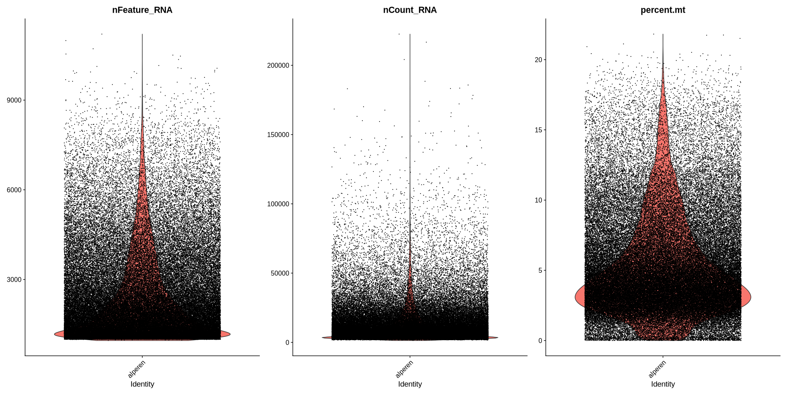
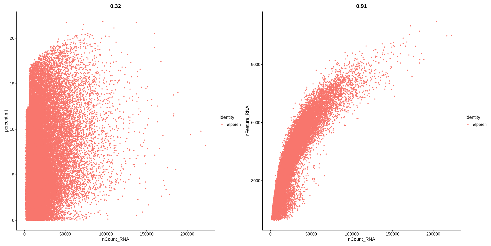
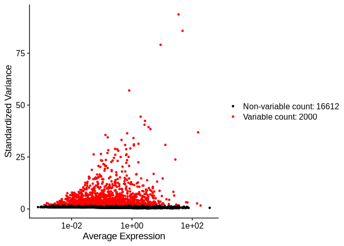

# Single-cell Analysis Assesment. Alperen Uysal, MD, PhDc. Ege University, Izmir, Turkey.

## 1. Data Preprocessing and Seurat Object Creation

Utilize the R package Seurat, designed for quality control, analysis,
and exploration of single-cell RNA-seq data
<https://satijalab.org/seurat/>. Load the downloaded data into R and
create a Seurat object. Perform initial quality control measures,
including filtering out low-quality cells and genes, normalizing the
data, and identifying highly variable features.

# Workflow:

The code below loads the Seurat library and sets the working directory.
It reads a sparse matrix of scRNA-seq data, including counts, cell
barcodes, and features, using `ReadMtx`. A Seurat object is created with
`CreateSeuratObject`, filtering cells with fewer than 500 genes and
genes detected in fewer than 1000 cells.

``` r
library(Seurat)
```

    ## Loading required package: SeuratObject

    ## Loading required package: sp

    ## 
    ## Attaching package: 'SeuratObject'

    ## The following objects are masked from 'package:base':
    ## 
    ##     intersect, t

``` r
library(ggplot2)

# set the working directory
wd <- "/home/alperen/PycharmProjects/single_cell_assesment/"
setwd(wd)
```

The `min.cells` and `min.features` parameters were set to
higher-than-default values to optimize RAM usage and ensure the
successful completion of the assessment.

``` r
# read the data
adata <- ReadMtx(mtx = "../resource/GSE266577_counts_raw.mtx.gz",
                 cells = "../resource/GSE266577_barcodes.txt.gz",
                 features = "../resource/GSE266577_seurat_features.txt.gz",
                 feature.column = 1)

# create the seurat object
seurat.obj <- CreateSeuratObject(counts = adata,
                                 project = "alperen",
                                 min.cells = 500,
                                 min.features = 1000)
```

Then, the chunk below calculates the percentage of mitochondrial gene
expression (`percent.mt`) and adds it as metadata to the Seurat object.

``` r
# Add percentage of mitochondrial genes and total counts metadata
seurat.obj[["percent.mt"]] <- PercentageFeatureSet(seurat.obj, pattern = "^MT-")
```

The code below visualizes QC metrics for the Seurat object. `VlnPlot`
creates violin plots showing the distributions of detected genes
(`nFeature_RNA`), total RNA counts (`nCount_RNA`), and mitochondrial
gene percentage (`percent.mt`) across cells. `FeatureScatter` generates
scatter plots to examine relationships between QC metrics: one compares
total RNA counts with mitochondrial percentage, and the other compares
total RNA counts with detected genes. These visualizations help assess
cell quality and identify potential outliers.

``` r
# Visualize QC metrics as violin plots
VlnPlot(seurat.obj,
        features = c("nFeature_RNA", "nCount_RNA", "percent.mt"),
        ncol = 3,
        raster = F)
```

    ## Warning: Default search for "data" layer in "RNA" assay yielded no results;
    ## utilizing "counts" layer instead.

<!-- -->

``` r
# Scatter plots for QC metrics
FeatureScatter(seurat.obj,
               feature1 = "nCount_RNA",
               feature2 = "percent.mt",
               raster = F) +
  FeatureScatter(seurat.obj,
                 feature1 = "nCount_RNA",
                 feature2 = "nFeature_RNA",
                 raster = F)
```

<!-- -->

The code below filters the Seurat object (`seurat.obj`) to retain mostly
high-quality cells based on thresholds determined from QC metrics.
Specifically, it keeps cells with more than 200 and fewer than 7000
detected genes (`nFeature_RNA`), total RNA counts (`nCount_RNA`) between
1000 and 50000, and mitochondrial gene percentage (`percent.mt`) below
5%. This step removes low-quality cells.

``` r
# filter the data with the values obtained with plots
seurat.obj <- subset(seurat.obj,
                     subset = nFeature_RNA > 200 &
                       nFeature_RNA < 7000 & 
                       nCount_RNA > 1000 &
                       nCount_RNA < 50000 & 
                       percent.mt < 5)
```

The code below preprocesses the filtered Seurat object (`seurat.obj`) by
normalizing and identifying highly variable features. `NormalizeData`
applies log-normalization to the gene expression data, scaling each
cell’s total expression to 10,000 and then log-transforming it.
`FindVariableFeatures` identifies the top 2000 most variable genes using
the “vst” (variance-stabilizing transformation). The resulting
preprocessed object is stored as `seurat.obj`.

``` r
# normalize the data
seurat.obj <- NormalizeData(seurat.obj,
                            normalization.method = "LogNormalize",
                            scale.factor = 10000)
```

    ## Normalizing layer: counts

``` r
# feature selection
seurat.obj <- FindVariableFeatures(seurat.obj,
                                   selection.method = "vst",
                                   nfeatures = 2000)
```

    ## Finding variable features for layer counts

The code below identifies and visualizes the 10 most highly variable
genes in the preprocessed Seurat object (`seurat.obj`).

The `VariableFeatures` function retrieves the top 10 variable genes,
stored in `top10`.

`VariableFeaturePlot` generates a scatter plot of all variable features,
highlighting highly variable genes. `LabelPoints` adds labels to the top
10 genes on the plot, with `repel = TRUE` ensuring labels do not
overlap. Finally, the two plots are combined for visualization.

``` r
# Identify the 10 most highly variable genes
top10 <- head(VariableFeatures(seurat.obj), 10)

# plot variable features with and without labels
plot1 <- VariableFeaturePlot(seurat.obj)
plot2 <- LabelPoints(plot = plot1, points = top10, repel = TRUE)
```

    ## When using repel, set xnudge and ynudge to 0 for optimal results

``` r
plot1 + plot2
```

<!-- --> The
`seurat.obj` was saved to the project directory for other steps.

``` r
# save the data for further analysis
saveRDS(seurat.obj, file = "../output/preprocessed.rds")
```
