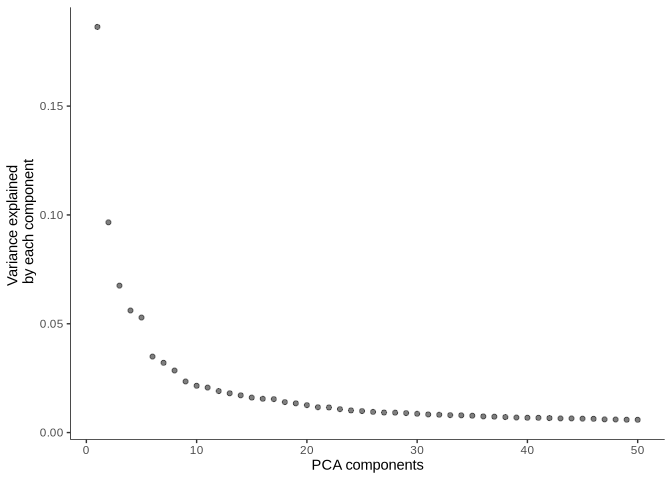
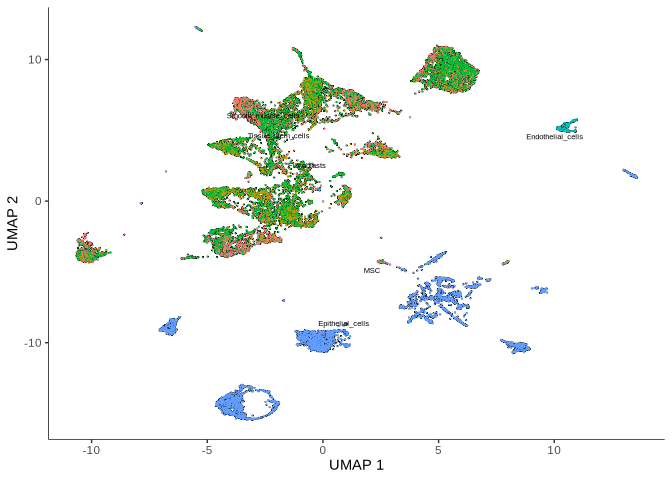
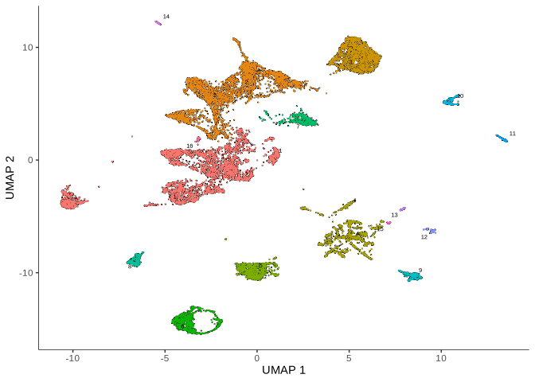
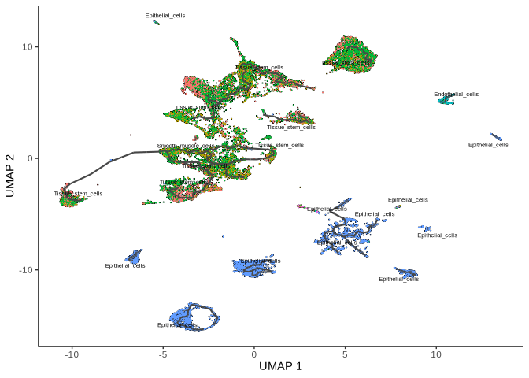
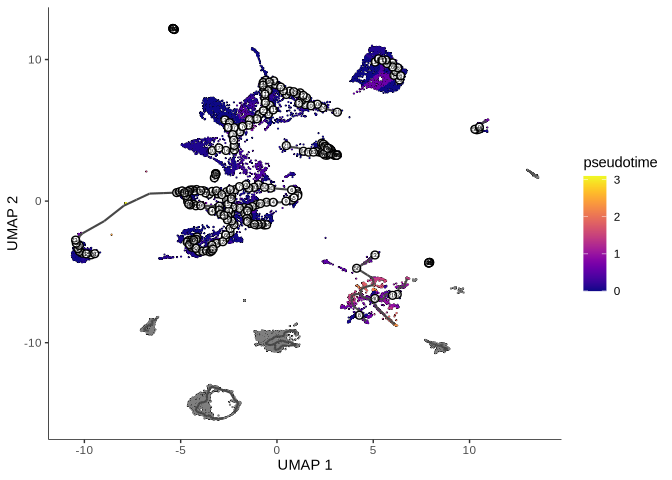

## Single-cell Analysis Assesment. Alperen Uysal, MD, PhDc. Ege University, Izmir, Turkey.

# 4. Trajectory Inference and Pseudotime Analysis:

``` r
# load the required libraries
library(monocle3)
```

    ## Loading required package: Biobase

    ## Loading required package: BiocGenerics

    ## 
    ## Attaching package: 'BiocGenerics'

    ## The following objects are masked from 'package:stats':
    ## 
    ##     IQR, mad, sd, var, xtabs

    ## The following objects are masked from 'package:base':
    ## 
    ##     anyDuplicated, aperm, append, as.data.frame, basename, cbind,
    ##     colnames, dirname, do.call, duplicated, eval, evalq, Filter, Find,
    ##     get, grep, grepl, intersect, is.unsorted, lapply, Map, mapply,
    ##     match, mget, order, paste, pmax, pmax.int, pmin, pmin.int,
    ##     Position, rank, rbind, Reduce, rownames, sapply, setdiff, sort,
    ##     table, tapply, union, unique, unsplit, which.max, which.min

    ## Welcome to Bioconductor
    ## 
    ##     Vignettes contain introductory material; view with
    ##     'browseVignettes()'. To cite Bioconductor, see
    ##     'citation("Biobase")', and for packages 'citation("pkgname")'.

    ## Loading required package: SingleCellExperiment

    ## Loading required package: SummarizedExperiment

    ## Loading required package: MatrixGenerics

    ## Loading required package: matrixStats

    ## 
    ## Attaching package: 'matrixStats'

    ## The following objects are masked from 'package:Biobase':
    ## 
    ##     anyMissing, rowMedians

    ## 
    ## Attaching package: 'MatrixGenerics'

    ## The following objects are masked from 'package:matrixStats':
    ## 
    ##     colAlls, colAnyNAs, colAnys, colAvgsPerRowSet, colCollapse,
    ##     colCounts, colCummaxs, colCummins, colCumprods, colCumsums,
    ##     colDiffs, colIQRDiffs, colIQRs, colLogSumExps, colMadDiffs,
    ##     colMads, colMaxs, colMeans2, colMedians, colMins, colOrderStats,
    ##     colProds, colQuantiles, colRanges, colRanks, colSdDiffs, colSds,
    ##     colSums2, colTabulates, colVarDiffs, colVars, colWeightedMads,
    ##     colWeightedMeans, colWeightedMedians, colWeightedSds,
    ##     colWeightedVars, rowAlls, rowAnyNAs, rowAnys, rowAvgsPerColSet,
    ##     rowCollapse, rowCounts, rowCummaxs, rowCummins, rowCumprods,
    ##     rowCumsums, rowDiffs, rowIQRDiffs, rowIQRs, rowLogSumExps,
    ##     rowMadDiffs, rowMads, rowMaxs, rowMeans2, rowMedians, rowMins,
    ##     rowOrderStats, rowProds, rowQuantiles, rowRanges, rowRanks,
    ##     rowSdDiffs, rowSds, rowSums2, rowTabulates, rowVarDiffs, rowVars,
    ##     rowWeightedMads, rowWeightedMeans, rowWeightedMedians,
    ##     rowWeightedSds, rowWeightedVars

    ## The following object is masked from 'package:Biobase':
    ## 
    ##     rowMedians

    ## Loading required package: GenomicRanges

    ## Loading required package: stats4

    ## Loading required package: S4Vectors

    ## 
    ## Attaching package: 'S4Vectors'

    ## The following object is masked from 'package:utils':
    ## 
    ##     findMatches

    ## The following objects are masked from 'package:base':
    ## 
    ##     expand.grid, I, unname

    ## Loading required package: IRanges

    ## Loading required package: GenomeInfoDb

    ## 
    ## Attaching package: 'monocle3'

    ## The following objects are masked from 'package:Biobase':
    ## 
    ##     exprs, fData, fData<-, pData, pData<-

``` r
library(Seurat)
```

    ## Loading required package: SeuratObject

    ## Loading required package: sp

    ## 
    ## Attaching package: 'sp'

    ## The following object is masked from 'package:IRanges':
    ## 
    ##     %over%

    ## 
    ## Attaching package: 'SeuratObject'

    ## The following object is masked from 'package:SummarizedExperiment':
    ## 
    ##     Assays

    ## The following object is masked from 'package:GenomicRanges':
    ## 
    ##     intersect

    ## The following object is masked from 'package:GenomeInfoDb':
    ## 
    ##     intersect

    ## The following object is masked from 'package:IRanges':
    ## 
    ##     intersect

    ## The following object is masked from 'package:S4Vectors':
    ## 
    ##     intersect

    ## The following object is masked from 'package:BiocGenerics':
    ## 
    ##     intersect

    ## The following objects are masked from 'package:base':
    ## 
    ##     intersect, t

    ## 
    ## Attaching package: 'Seurat'

    ## The following object is masked from 'package:SummarizedExperiment':
    ## 
    ##     Assays

``` r
library(SeuratWrappers)
```

Let’s load the data.

``` r
# load the final data
seurat.obj <- LoadSeuratRds(file = "../output/annotated.rds")
```

This code below filters a Seurat object (`seurat.obj`) to include only
specific cell types of interest. The steps are as follows:

A vector `cell_types` is created, listing the cell types to retain. The
active identities of the Seurat object are set to the
`annotation_labels` column using `Idents()`. The `subset()` function is
used to filter the Seurat object, keeping only the specified cell types
in `cell_types`. The filtered object is saved as `seurat.obj.filtered.`

``` r
# subset the seurat object
cell_types <- c("Endothelial_cells", "Epithelial_cells", "Fibroblasts", "Smooth_muscle_cells", "Tissue_stem_cells", "MSC")
Idents(seurat.obj) <- seurat.obj$annotation_labels
seurat.obj.filtered <- subset(seurat.obj, idents = cell_types)
```

The code below converts a Seurat object (`seurat.obj`) into a `Monocle3`
`cell_data_set` object.

The `as.cell_data_set()` function facilitates compatibility between
`Seurat` and `Monocle3`, enabling trajectory analysis and other
Monocle3-specific workflows. The resulting cds object can now be used
for downstream analyses in `Monocle3`.

``` r
cds <- as.cell_data_set(seurat.obj.filtered)
```

    ## Warning: Monocle 3 trajectories require cluster partitions, which Seurat does
    ## not calculate. Please run 'cluster_cells' on your cell_data_set object

This step normalizes the data and reduces its dimensions using Principal
Component Analysis (PCA). The `num_dim` parameter specifies the number
of principal components to retain for downstream analyses.

``` r
# Preprocess the data
cds <- preprocess_cds(cds, num_dim = 50)
```

This function plots the proportion of variance explained by each
principal component. It helps determine the optimal number of dimensions
to use for subsequent steps.

``` r
plot_pc_variance_explained(cds)
```

<!-- -->

This step applies Uniform Manifold Approximation and Projection (UMAP)
to reduce the data into two or three dimensions for visualization. It
uses the PCA results as input.

``` r
cds <- reduce_dimension(cds, reduction_method = "UMAP")
```

    ## No preprocess_method specified, using preprocess_method = 'PCA'

This function visualizes cells in the UMAP space. Cells are colored
based on the ident attribute (e.g., cell types), while cluster labels
can optionally be displayed.

``` r
plot_cells(cds, label_groups_by_cluster=T,  color_cells_by = "ident")
```

    ## No trajectory to plot. Has learn_graph() been called yet?

<!-- --> This step
clusters cells using the UMAP embeddings. Monocle3 applies Louvain
clustering to identify groups of similar cells.

``` r
cds <- cluster_cells(cds, reduction_method = "UMAP")
```

This visualization shows the clusters (partitions) identified by the
clustering step. It helps interpret the grouping of cells.

``` r
plot_cells(cds, color_cells_by = "partition")
```

    ## No trajectory to plot. Has learn_graph() been called yet?

<!-- --> This
step infers a trajectory graph that represents the relationships and
potential differentiation paths between clusters of cells.

``` r
cds <- learn_graph(cds)
```

    ##   |                                                                              |                                                                      |   0%  |                                                                              |======================================================================| 100%
    ##   |                                                                              |                                                                      |   0%  |                                                                              |======================================================================| 100%
    ##   |                                                                              |                                                                      |   0%  |                                                                              |======================================================================| 100%
    ##   |                                                                              |                                                                      |   0%  |                                                                              |======================================================================| 100%
    ##   |                                                                              |                                                                      |   0%  |                                                                              |======================================================================| 100%
    ##   |                                                                              |                                                                      |   0%  |                                                                              |======================================================================| 100%
    ##   |                                                                              |                                                                      |   0%  |                                                                              |======================================================================| 100%
    ##   |                                                                              |                                                                      |   0%  |                                                                              |======================================================================| 100%

    ## Warning in min(data_df$weight[data_df$weight > 0]): no non-missing arguments to
    ## min; returning Inf

This visualization overlays the trajectory graph on the UMAP space,
showing how cells are connected in developmental pathways. The ident
attribute determines cell colors.

``` r
plot_cells(cds,
           color_cells_by = "ident",
           label_groups_by_cluster=T,
           label_leaves=FALSE,
           label_branch_points=FALSE)
```

<!-- -->

This step orders cells along the trajectory graph, assigning pseudotime
values that represent their progression along differentiation or
developmental paths. This code selects “Tissue_stem_cells” as the root
population for pseudotime analysis. It filters the Seurat object to
include only these cells, extracts their names (`root_cells`), and uses
them to define the starting point for ordering cells in the Monocle3
trajectory.

``` r
# set the root cells and order the cells
filtered_root <- seurat.obj.filtered[, seurat.obj.filtered@meta.data$annotation_labels == "Tissue_stem_cells"]
root_cells <- rownames(filtered_root@meta.data)
cds <- order_cells(cds, reduction_method = "UMAP", root_cells = root_cells)
```

This plot shows cells colored by their pseudotime values, providing
insights into the progression of cells along the inferred trajectory.

``` r
plot_cells(cds,
           color_cells_by = "pseudotime",
           label_cell_groups=FALSE,
           label_leaves=FALSE,
           label_branch_points=FALSE,
           graph_label_size=1.5)
```

<!-- -->
